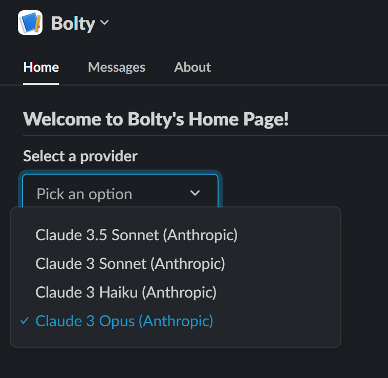
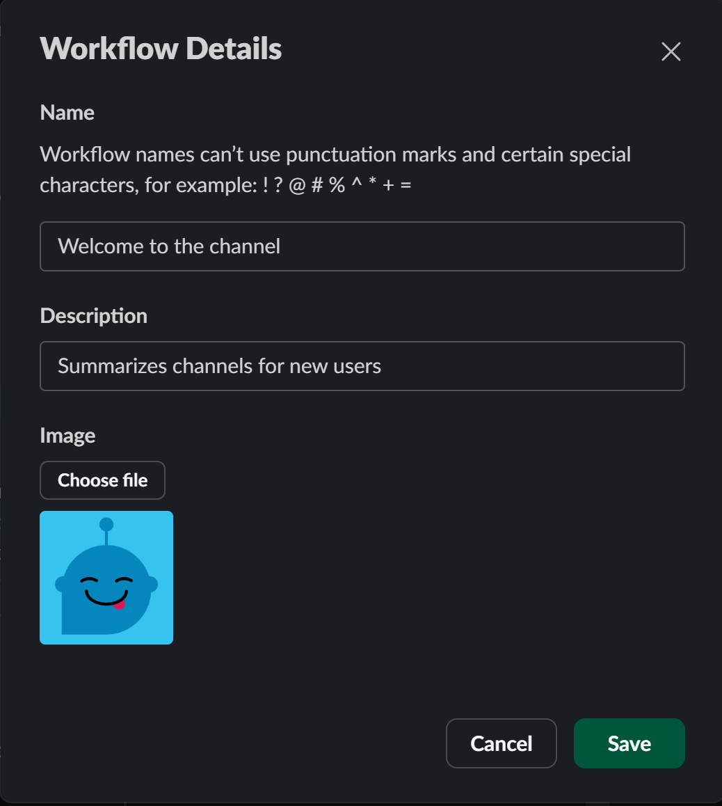
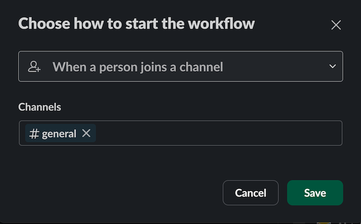
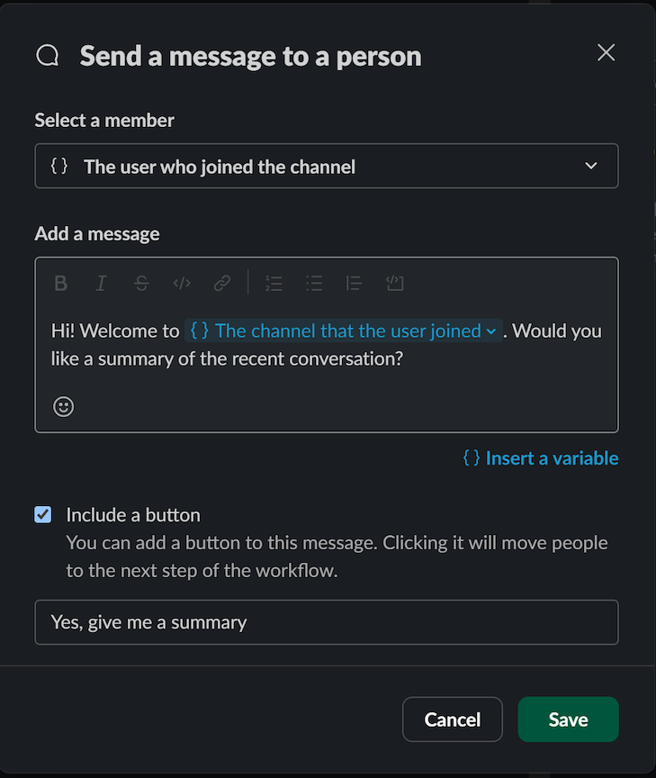
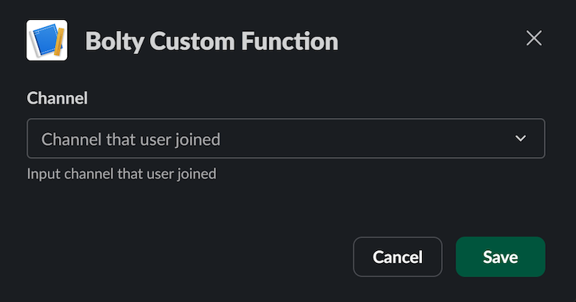
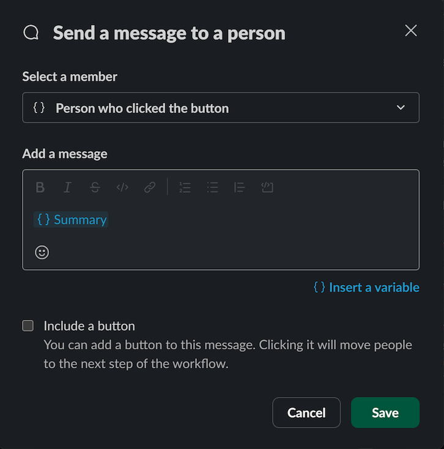
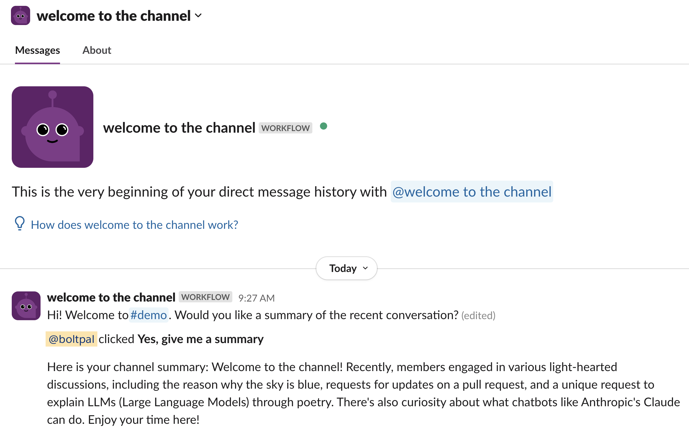
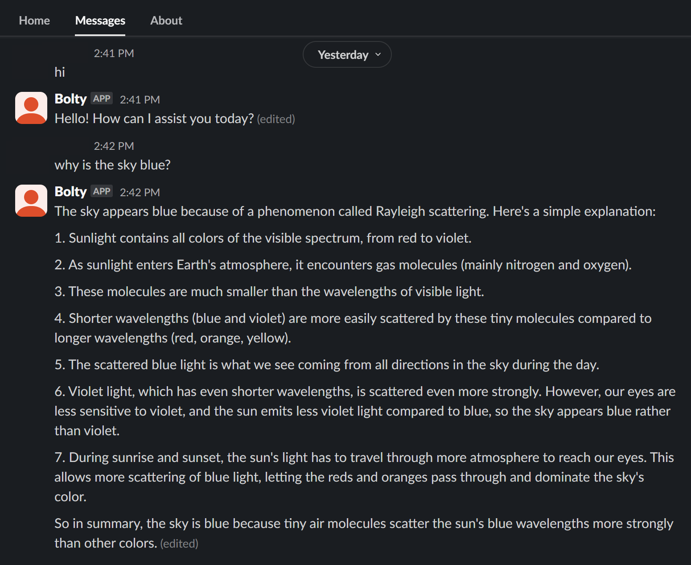

# AI Chatbot

In this tutorial, you'll learn how to bring the power of AI into your Slack workspace using a chatbot called Bolty that uses Anthropic or OpenAI. Here's what we'll do with this sample app:

1. Create your app from an app manifest and clone a starter template
2. Set up and run your local project
3. Create a workflow using Workflow Builder to summarize messages in conversations
4. Select your preferred API and model to customize Bolty's responses
5. Interact with Bolty via direct message, the `/ask-bolty` slash command, or by mentioning the app in conversations

## Prerequisites {#prereqs}

Before getting started, you will need the following:

* a development workspace where you have permissions to install apps. If you don’t have a workspace, go ahead and set that up now — you can [go here](https://slack.com/get-started#create) to create one, or you can join the [Developer Program](https://api.slack.com/developer-program) and provision a sandbox with access to all Slack features for free.
* a development environment with [Python 3.6](https://www.python.org/downloads/) or later.
* an Anthropic or OpenAI account with sufficient credits, and in which you have generated a secret key.

**Skip to the code**
If you'd rather skip the tutorial and just head straight to the code, you can use our [Bolt for Python AI Chatbot sample](https://github.com/slack-samples/bolt-python-ai-chatbot) as a template.

## Creating your app {#create-app}

1. Navigate to the [app creation page](https://api.slack.com/apps/new) and select **From a manifest**.
2. Select the workspace you want to install the application in.
3. Copy the contents of the [`manifest.json`](https://github.com/slack-samples/bolt-python-ai-chatbot/blob/main/manifest.json) file into the text box that says **Paste your manifest code here** (within the **JSON** tab) and click **Next**.
4. Review the configuration and click **Create**.
5. You're now in your app configuration's **Basic Information** page. Navigate to the **Install App** link in the left nav and click **Install to Workspace*, then **Allow** on the screen that follows.

### Obtaining and storing your environment variables {#environment-variables}

Before you'll be able to successfully run the app, you'll need to first obtain and set some environment variables.

1. On the **Install App** page, copy your **Bot User OAuth Token**. You will store this in your environment as `SLACK_BOT_TOKEN` (we'll get to that next).
2. Navigate to **Basic Information** and in the **App-Level Tokens** section , click **Generate Token and Scopes**. Add the [`connections:write`](/reference/scopes/connections.write) scope, name the token, and click **Generate**. (For more details, refer to [understanding OAuth scopes for bots](/authentication/tokens#bot)). Copy this token. You will store this in your environment as `SLACK_APP_TOKEN`.

To store your tokens and environment variables, run the following commands in the terminal. Replace the placeholder values with your bot and app tokens collected above, as well as the key or keys for the AI provider or providers you want to use:

**For macOS**
```bash
export SLACK_BOT_TOKEN=<your-bot-token>
export SLACK_APP_TOKEN=<your-app-token>
export OPENAI_API_KEY=<your-api-key>
export ANTHROPIC_API_KEY=<your-api-key>
```

**For Windows**
```bash
set SLACK_BOT_TOKEN=<your-bot-token>
set SLACK_APP_TOKEN=<your-app-token>
set OPENAI_API_KEY=<your-api-key>
set ANTHROPIC_API_KEY=<your-api-key>
```

## Setting up and running your local project {#configure-project}

Clone the starter template onto your machine by running the following command:

```bash
git clone https://github.com/slack-samples/bolt-python-ai-chatbot.git
```

Change into the new project directory:

```bash
cd bolt-python-ai-chatbot
```

Start your Python virtual environment:

**For macOS**
```bash
python3 -m venv .venv
source .venv/bin/activate
```

**For Windows**
```bash
py -m venv .venv
.venv\Scripts\activate
```

Install the required dependencies:

```bash
pip install -r requirements.txt
```

Start your local server:

```bash
python app.py
```

If your app is up and running, you'll see a message that says "⚡️ Bolt app is running!"

## Choosing your provider {#provider}

Navigate to the Bolty **App Home** and select a provider from the drop-down menu. The options listed will be dependent on which secret keys you added when setting your environment variables.

If you don't see Bolty listed under **Apps** in your workspace right away, never fear! You can mention **@Bolty** in a public channel to add the app, then navigate to your **App Home**.



## Setting up your workflow {#workflow}

Within your development workspace, open Workflow Builder by clicking on your workspace name and then **Tools > Workflow Builder**. Select **New Workflow** > **Build Workflow**.

Click **Untitled Workflow** at the top to rename your workflow. For this tutorial, we'll call the workflow **Welcome to the channel**. Enter a description, such as _Summarizes channels for new members_, and click **Save**.



Select **Choose an event** under **Start the workflow...**, and then choose **When a person joins a channel**. Select the channel name from the drop-down menu and click **Save**.



Under **Then, do these things**, click **Add steps** and complete the following:

1. Select **Messages** > **Send a message to a person**.
2. Under **Select a member**, choose **The user who joined the channel** from the drop-down menu.
3. Under **Add a message**, enter a short message, such as _Hi! Welcome to `{}The channel that the user joined`. Would you like a summary of the recent conversation?_ Note that the _`{}The channel that the user joined`_ is a variable; you can insert it by selecting **{}Insert a variable** at the bottom of the message text box.
4. Select the **Add Button** button, and name the button _Yes, give me a summary_. Click **Done**.



We'll add two more steps under the **Then, do these things** section. 

First, scroll to the bottom of the list of steps and choose **Custom**, then choose **Bolty** and **Bolty Custom Function**. In the **Channel** drop-down menu, select **Channel that the user joined**. Click **Save**.



For the final step, complete the following:

1. Choose **Messages** and then **Send a message to a person**. Under **Select a member**, choose **Person who clicked the button** from the drop-down menu.
2. Under **Add a message**, click **Insert a variable** and choose **`{}Summary`** under the **Bolty Custom Function** section in the list that appears. Click **Save**.



When finished, click **Finish Up**, then click **Publish** to make the workflow available in your workspace.

## Interacting with Bolty {#interact}

### Summarizing recent conversations {#summarize}

In order for Bolty to provide summaries of recent conversation in a channel, Bolty _must_ be a member of that channel. 

1. Invite Bolty to a channel that you are able to leave and rejoin (for example, not the **#general** channel or a private channel someone else created) by mentioning the app in the channel — i.e., tagging **@Bolty** in the channel and sending your message.
2. Slackbot will prompt you to either invite Bolty to the channel, or do nothing. Click **Invite Them**. Now when new users join the channel, the workflow you just created will be kicked off.

To test this, leave the channel you just invited Bolty to and rejoin it. This will kick off your workflow and you'll receive a direct message from **Welcome to the channel**. Click the **Yes, give me a summary** button, and Bolty will summarize the recent conversations in the channel you joined.



The central part of this functionality is shown in the following code snippet. Note the use of the [`user_context`](/tools/deno-slack-sdk/reference/slack-types#usercontext) object, a Slack type that represents the user who is interacting with our workflow, as well as the `history` of the channel that will be summarized, which includes the ten most recent messages.

```python
from ai.providers import get_provider_response
from logging import Logger
from slack_bolt import Complete, Fail, Ack
from slack_sdk import WebClient
from ..listener_utils.listener_constants import SUMMARIZE_CHANNEL_WORKFLOW
from ..listener_utils.parse_conversation import parse_conversation

"""
Handles the event to summarize a Slack channel's conversation history.
It retrieves the conversation history, parses it, generates a summary using an AI response,
and completes the workflow with the summary or fails if an error occurs.
"""

def handle_summary_function_callback(
    ack: Ack, inputs: dict, fail: Fail, logger: Logger, client: WebClient, complete: Complete
):
    ack()
    try:
        user_context = inputs["user_context"]
        channel_id = inputs["channel_id"]
        history = client.conversations_history(channel=channel_id, limit=10)["messages"]
        conversation = parse_conversation(history)

        summary = get_provider_response(user_context["id"], SUMMARIZE_CHANNEL_WORKFLOW, conversation)

        complete({"user_context": user_context, "response": summary})
    except Exception as e:
        logger.exception(e)
        fail(e)
```

### Asking Bolty a question {#ask-app}

To ask Bolty a question, you can chat with Bolty in any channel the app is in. Use the `\ask-bolty` slash command to provide a prompt for Bolty to answer. Note that Bolty is currently not supported in threads.

You can also navigate to **Bolty** in your **Apps** list and select the **Messages** tab to chat with Bolty directly. 



## Next steps {#next-steps}

Congratulations! You've successfully integrated the power of AI into your workspace. Check out these links to take the next steps in your Bolt for Python journey.

* To learn more about Bolt for Python, refer to the [Getting started](/tools/bolt-python/getting-started) documentation.
* For more details about creating workflow steps using the Bolt SDK, refer to the [workflow steps for Bolt](/workflows/workflow-steps) guide.
* To use the Bolt for Python SDK to develop on the automations platform, refer to the [Create a workflow step for Workflow Builder: Bolt for Python](/tools/bolt-python/tutorial/custom-steps-workflow-builder-new) tutorial.
