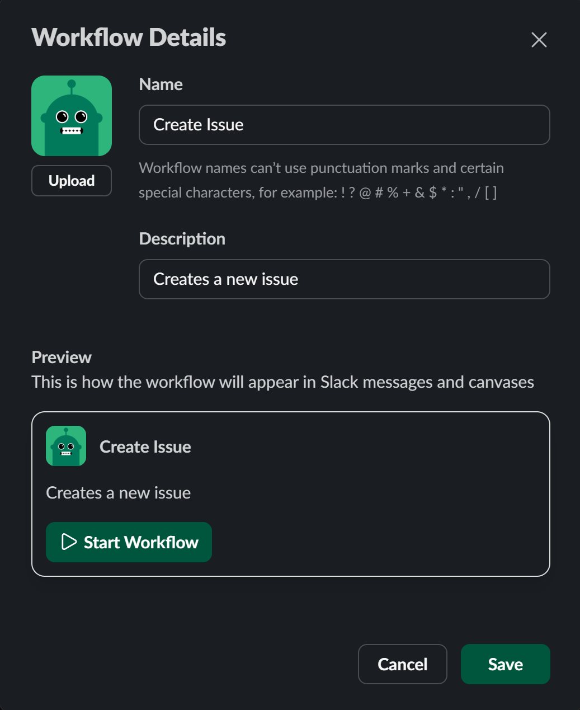
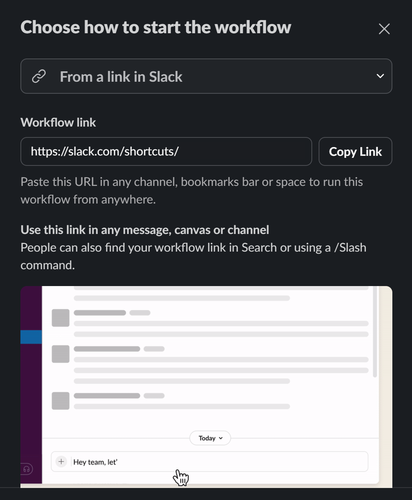
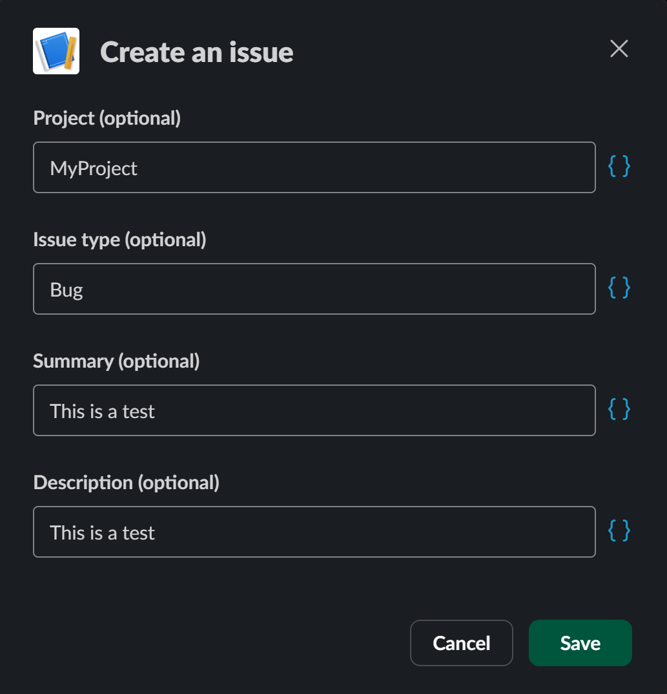
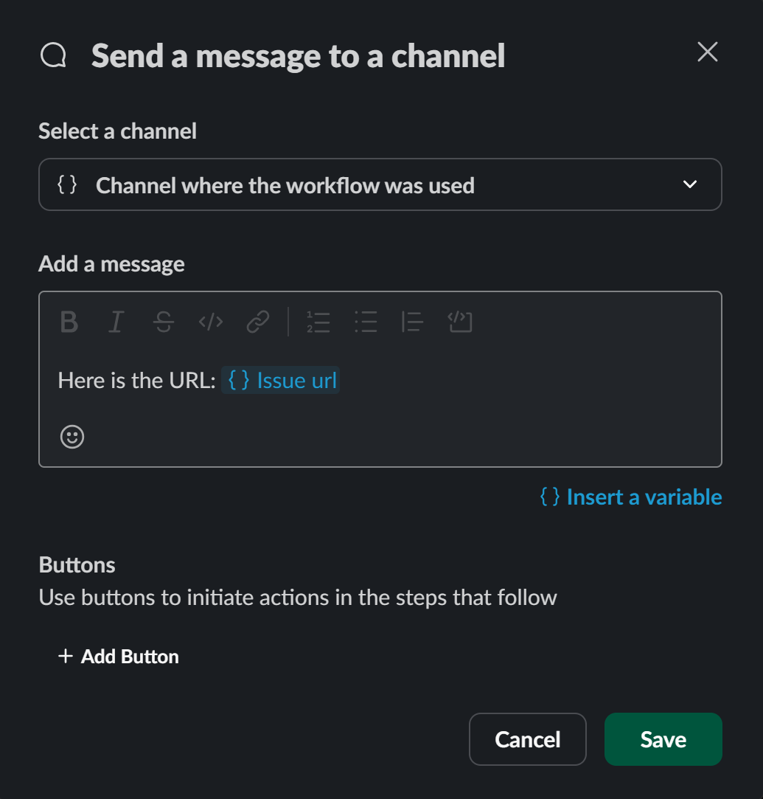
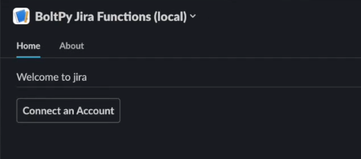
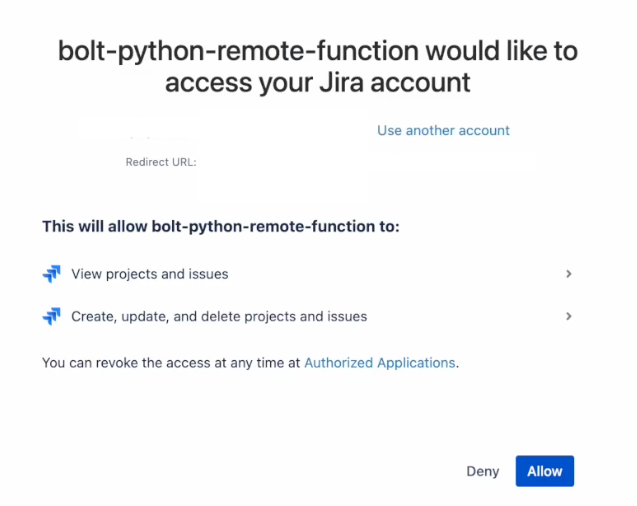
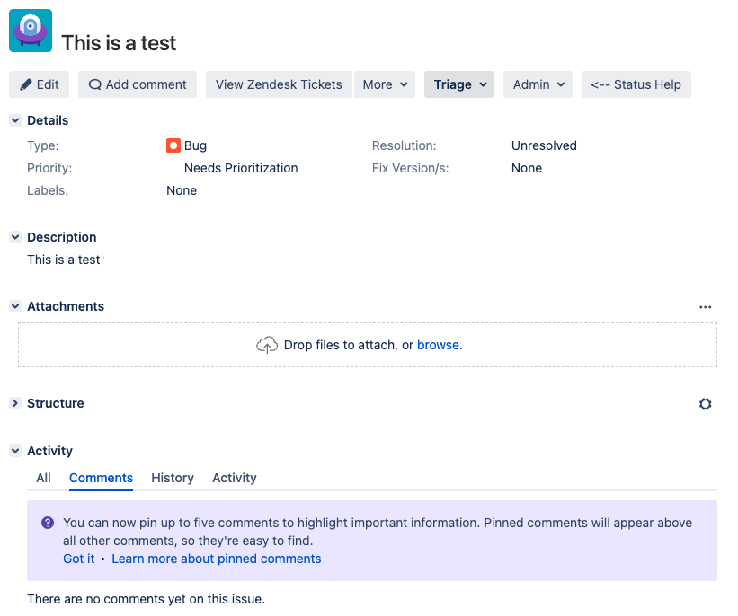

# Custom steps for JIRA

In this tutorial, you'll learn how to configure custom steps for use with JIRA. Here's what we'll do with this sample app:

1. Create your app from an app manifest and clone a starter template
2. Set up and run your local project
3. Create a workflow with a custom step using Workflow Builder
4. Create an issue in JIRA using your custom step

## Prerequisites {#prereqs}

Before getting started, you will need the following:

* a development workspace where you have permissions to install apps. If you don’t have a workspace, go ahead and set that up now—you can [go here](https://slack.com/get-started#create) to create one, or you can join the [Developer Program](https://api.slack.com/developer-program) and provision a sandbox with access to all Slack features for free.
* a development environment with [Python 3.6](https://www.python.org/downloads/) or later.

**Skip to the code**
If you'd rather skip the tutorial and just head straight to the code, you can use our [Bolt for Python JIRA functions sample](https://github.com/slack-samples/bolt-python-jira-functions) as a template.

## Creating your app {#create-app}

1. Navigate to the [app creation page](https://api.slack.com/apps/new) and select **From a manifest**.
2. Select the workspace you want to install the application in, then click **Next**.
3. Copy the contents of the [`manifest.json`](https://github.com/slack-samples/bolt-python-jira-functions/blob/main/manifest.json) file below into the text box that says **Paste your manifest code here** (within the **JSON** tab), then click **Next**:

```js reference title="manifest.json"
https://github.com/slack-samples/bolt-python-jira-functions/blob/main/manifest.json
```

4. Review the configuration and click **Create**.
5. You're now in your app configuration's **Basic Information** page. Click **Install App**, then **Install to _your-workspace-name_**, then **Allow** on the screen that follows.

### Obtaining and storing your environment variables {#environment-variables}

Before you'll be able to successfully run the app, you'll need to obtain and set some environment variables.

1. Once you have installed the app to your workspace, copy the **Bot User OAuth Token** from the **Install App** page. You will store this in your environment as `SLACK_BOT_TOKEN` (we'll get to that next).
2. Navigate to **Basic Information** and in the **App-Level Tokens** section , click **Generate Token and Scopes**. Add the [`connections:write`](/reference/scopes/connections.write) scope, name the token, and click **Generate**. Copy this token. You will store this in your environment as `SLACK_APP_TOKEN`.
3. Follow [these instructions](https://confluence.atlassian.com/adminjiraserver0909/configure-an-incoming-link-1251415519.html) to create an external app link and to generate its redirect URL (the base of which will be stored as your APP_BASE_URL variable below), client ID, and client secret.
4. Run the following commands in your terminal to store your environment variables, client ID, and client secret.
5. You'll also need to know your team ID (found by opening your Slack instance in a web browser and copying the value within the link that starts with the letter **T**) and your app ID (found under **Basic Information**).

**For macOS**
```bash
export SLACK_BOT_TOKEN=<your-bot-token>
export SLACK_APP_TOKEN=<your-app-token>
export JIRA_CLIENT_ID=<client-id>
export JIRA_CLIENT_SECRET=<client-secret>
```

**For Windows**
```bash
set SLACK_BOT_TOKEN=<your-bot-token>
set SLACK_APP_TOKEN=<your-app-token>
set JIRA_CLIENT_ID=<client-id>
set JIRA_CLIENT_SECRET=<client-secret>
```

## Setting up and running your local project {#configure-project}

Clone the starter template onto your machine by running the following command:

```bash
git clone https://github.com/slack-samples/bolt-python-jira-functions.git
```

Change into the new project directory:

```bash
cd bolt-python-jira-functions
```

Start your Python virtual environment:

import Tabs from '@theme/Tabs';
import TabItem from '@theme/TabItem';

<Tabs groupId="os">
<TabItem value="macos" label="For macOS">

```bash
python3 -m venv .venv
source .venv/bin/activate
```

</TabItem>
<TabItem value="windows" label="For Windows">

```bash
py -m venv .venv
.venv\Scripts\activate
```
</TabItem>
</Tabs>

Install the required dependencies:

```bash
pip install -r requirements.txt
```

Rename the `.example.env` file to `.env` and replace the values for each of the variables listed in the file:

```
JIRA_BASE_URL=https://your-jira-instance.com
SECRET_HEADER_KEY=Your-Header
SECRET_HEADER_VALUE=abc123
JIRA_CLIENT_ID=abc123
JIRA_CLIENT_SECRET=abc123
APP_BASE_URL=https://1234-123-123-12.ngrok-free.app
APP_HOME_PAGE_URL=slack://app?team=YOUR_TEAM_ID&id=YOUR_APP_ID&tab=home
```

You could also store the values for your `SLACK_BOT_TOKEN` and `SLACK_APP_TOKEN` here.

Start your local server:

```bash
python app.py
```

If your app is up and running, you'll see a message noting that the app is starting to receive messages from a new connection.

## Setting up your workflow in Workflow Builder {#workflow}

1. Within your development workspace, open Workflow Builder by clicking your workspace name and then selecting **Tools** > **Workflow Builder**. 
2. Select **New Workflow** > **Build Workflow**.
3. Click **Untitled Workflow** at the top of the pane to rename your workflow. We'll call it **Create Issue**. For the description, enter _Creates a new issue_, then click **Save**.



4. Select **Choose an event** under **Start the workflow...**, and then select **From a link in Slack**. Click **Continue**.



5. Under **Then, do these things** click **Add steps** to add the custom step. Your custom step will be the function defined in the [`create_issue.py`](https://github.com/slack-samples/bolt-python-jira-functions/blob/main/listeners/functions/create_issue.py) file. 

    Scroll down to the bottom of the list on the right-hand pane and select **Custom**, then **BoltPy Jira Functions** > **Create an issue**. Enter the project details, issue type (optional), summary (optional), and description (optional). Click **Save**.



6. Add another step and select **Messages** > **Send a message to a channel**. Select **Channel where the workflow was used** from the drop-down list and then select **Insert a variable** and **Issue url**. Click **Save**.



7. Click **Publish** to make the workflow available to your workspace.

## Running your app {#run}

1. Copy your workflow link.
2. Navigate to your app's home tab and click **Connect an Account** to connect your JIRA account to the app. 



3. Click **Allow** on the screen that appears.



4. In any channel, post the workflow link you copied.
5. Click **Start Workflow** and observe as the link to a new JIRA ticket is posted in the channel. Click the link to be directed to the newly-created issue within your JIRA project.



When finished, you can click the **Disconnect Account** button in the home tab to disconnect your app from your JIRA account.

## Next steps {#next-steps}

Congratulations! You've successfully customized your workspace with custom steps in Workflow Builder. Check out these links to take the next steps in your journey.

* To learn more about Bolt for Python, refer to the [getting started](/tools/bolt-python/getting-started) documentation.
* For more details about creating workflow steps using the Bolt SDK, refer to the [workflow steps for Bolt](/workflows/workflow-steps) guide.
* For information about custom steps dynamic options, refer to [custom steps dynamic options in Workflow Builder](/tools/bolt-python/concepts/custom-steps-dynamic-options).
