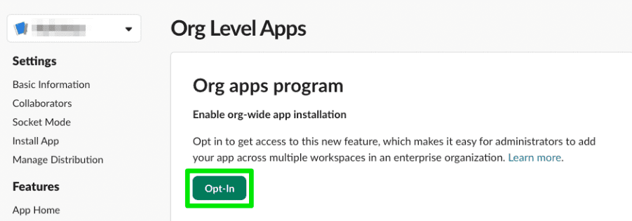
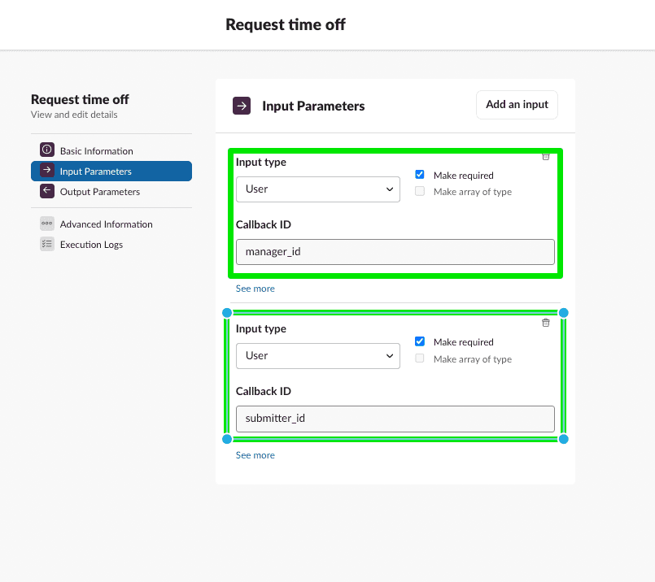
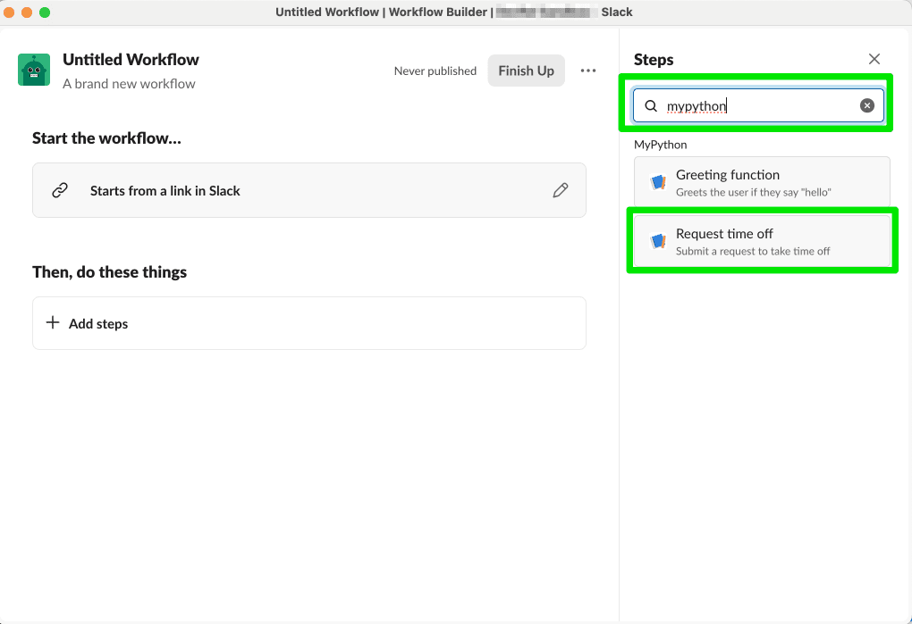
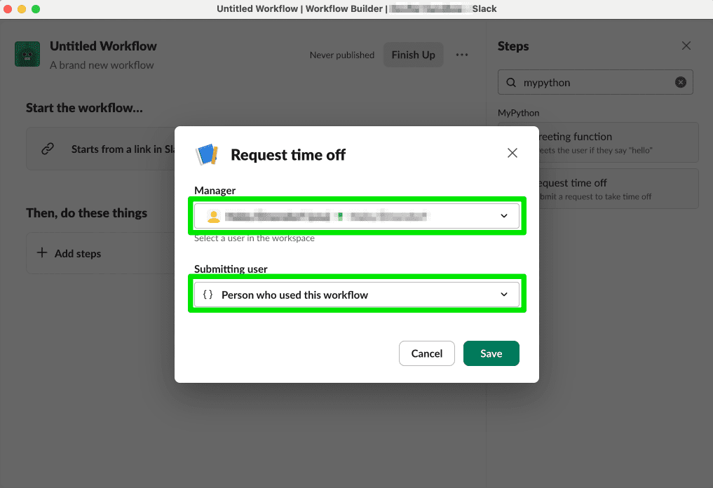

:::info[This feature requires a paid plan]
If you don't have a paid workspace for development, you can join the [Developer Program](https://api.slack.com/developer-program) and provision a sandbox with access to all Slack features for free.
:::

If you followed along with our [create a custom step for Workflow Builder: new app](/bolt-python/tutorial/custom-steps-workflow-builder-new) tutorial, you have seen how to add custom steps to a brand new app. But what if you have an app up and running currently to which you'd like to add custom steps? You've come to the right place!

In this tutorial we will:
- Start with an existing Bolt app
- Add a custom **workflow step** in the [app settings](https://api.slack.com/apps)
- Wire up the new step to a **function listener** in our project, using the [Bolt for Python](https://slack.dev/bolt-python/) framework
- See the step as a custom workflow step in Workflow Builder

## Prerequisites {#prereqs}

The custom steps feature is compatible with Bolt version 1.20.0 and above. First, update your `package.json` file to reflect version 1.20.0 of Bolt, then run the following command in your terminal:

```sh
python3 -m venv .venv 
source .venv/bin/activate 
pip install -r requirements.txt
```

In order to add custom workflow steps to an app, the app also needs to be org-ready. To do this, navigate to your [app settings page](https://api.slack.com/apps) and select your Bolt app. 

Navigate to **Org Level Apps** in the left nav and click **Opt-In**, then confirm **Yes, Opt-In**.



## Adding a new workflow step {#add-step}

Before we can add the new workflow step, we first need to ensure the workflow step is listening for the `function_executed` event so that our app knows when the workflow step is executed.

### Adding the `function_executed` event subscription {#event-subscription}

Navigate to **App Manifest** in the left nav and add the `function_executed` event subscription, then click **Save Changes**:

```json
...
    "settings": {
        "event_subscriptions": {
            "bot_events": [
				...
                "function_executed"
            ]
        },
	}
```

### Adding the workflow step {#add-step}

Navigate to **Workflow Steps** in the left nav and click **Add Step**. This is where we'll configure our step's inputs, outputs, name, and description.


For illustration purposes in this tutorial, we're going to write a custom step called Request Time Off. When the step is invoked, a message will be sent to the provided manager with an option to approve or deny the time-off request. When the manager takes an action (approves or denies the request), a message is posted with the decision and the manager who made the decision. The step will take two user IDs as inputs, representing the requesting user and their manager, and it will output both of those user IDs as well as the decision made.

Add the pertinent details to the step:


Remember this `callback_id`. We will use this later when implementing a function listener. Then add the input and output parameters:




Save your changes.

### Viewing our updates in the App Manifest {#view-updates}

Navigate to **App Manifest** and notice your new step reflected in the `functions` property! Exciting. It should look like this:

```json
"functions": {
        "request_time_off": {
            "title": "Request time off",
            "description": "Submit a request to take time off",
            "input_parameters": {
                "manager_id": {
                    "type": "slack#/types/user_id",
                    "title": "Manager",
                    "description": "Approving manager",
                    "is_required": true,
                    "hint": "Select a user in the workspace",
                    "name": "manager_id"
                },
                "submitter_id": {
                    "type": "slack#/types/user_id",
                    "title": "Submitting user",
                    "description": "User that submitted the request",
                    "is_required": true,
                    "name": "submitter_id"
                }
            },
            "output_parameters": {
                "manager_id": {
                    "type": "slack#/types/user_id",
                    "title": "Manager",
                    "description": "Approving manager",
                    "is_required": true,
                    "name": "manager_id"
                },
                "request_decision": {
                    "type": "boolean",
                    "title": "Request decision",
                    "description": "Decision to the request for time off",
                    "is_required": true,
                    "name": "request_decision"
                },
                "submitter_id": {
                    "type": "slack#/types/user_id",
                    "title": "Submitting user",
                    "description": "User that submitted the request",
                    "is_required": true,
                    "name": "submitter_id"
                }
            }
        }
    }
```

Next, we'll define a function listener to handle what happens when the workflow step is used.

## Adding function and action listeners {#adding-listeners}

### Implementing the function listener {#function-listener}

Direct your attention back to your app project in VSCode or your preferred code editor. Here we'll add logic that your app will execute when the custom step is executed. 

Open your `app.py` file and add the following function listener code for the `request_time_off` step. 

```py
@app.function("request_time_off")
def handle_request_time_off(inputs: dict, fail: Fail, logger: logging.Logger, say: Say):

    submitter_id = inputs["submitter_id"]
    manager_id = inputs["manager_id"]

    try:
        say(
            channel=manager_id,
            text=f"<@{submitter_id}> requested time off! What say you?",
            blocks=[
                {
                    "type": 'section',
                    "text": {
                        "type": 'mrkdwn',
                        "text": f"<@{submitter_id}> requested time off! What say you?",
                    },
                },
                {
                    'type': 'actions',
                    'elements': [
                        {
                            'type': 'button',
                            'text': {
                                'type': 'plain_text',
                                'text': 'Approve',
                                'emoji': True,
                            },
                            'value': 'approve',
                            'action_id': 'approve_button',
                        },
                        {
                            'type': 'button',
                            'text': {
                                'type': 'plain_text',
                                'text': 'Deny',
                                'emoji': True,
                            },
                            'value': 'deny',
                            'action_id': 'deny_button',
                        },
                    ],
                },
            ],
        )
    except Exception as e:
        logger.exception(e)
        fail(f"Failed to handle a function request (error: {e})")
```

#### Anatomy of a `.function()` listener {#function-listener-anatomy}

The function decorator (`function()`) accepts an argument of type `str` and is the unique callback ID of the step. For our custom step, we’re using `request_time_off`. Every custom step you implement in an app needs to have a unique callback ID.

The callback function is where we define the logic that will run when Slack tells the app that a user in the Slack client started a workflow that contains the `request_time_off` custom step.

The callback function offers various utilities that can be used to take action when a function execution event is received. The ones we’ll be using here are:

* `inputs` provides access to the workflow variables passed into the step when the workflow was started
* `fail` indicates when the step invoked for the current workflow step has an error
* `logger` provides a Python standard logger instance
* `say` calls the `chat.Postmessage` API method

### Implementing the action listener {#action-listener}

This custom step also requires an action listener to respond to the action of a user clicking a button. 

In that same `app.py` file, add the following action listener:

```py
@app.action(re.compile("(approve_button|deny_button)"))
def manager_resp_handler(ack: Ack, action, body: dict, client: WebClient, complete: Complete, fail: Fail, logger: logging.Logger):

    ack()

    try:
        inputs = body['function_data']['inputs']
        manager_id = inputs['manager_id']
        submitter_id = inputs['submitter_id']
        request_decision = action['value']

        client.chat_update(
            channel=body['channel']['id'],
            message=body['message'],
            ts=body["message"]["ts"],
            text=f'Request {"approved" if request_decision == 'approve' else "denied"}!'
        )

        complete({
            'manager_id': manager_id,
            'submitter_id': submitter_id,
            'request_decision':  request_decision == 'approve'
        })

    except Exception as e:
        logger.exception(e)
        fail(f"Failed to handle a function request (error: {e})")
```

#### Anatomy of an `.action()` listener {#action-listener-anatomy}

Similar to a function listener, the action listener registration method (`.action()`) takes two arguments:

- The first argument is the unique callback ID of the action that your app will respond to. In our case, because we want to execute the same logic for both buttons, we’re using a little bit of RegEx magic to listen for two callback IDs at the same time — `approve_button` and `deny_button`.
- The second argument is an asynchronous callback function, where we define the logic that will run when Slack tells our app that the manager has clicked or tapped the Approve button or the Deny button.

Just like the function listener’s callback function, the action listener’s callback function offers various utilities that can be used to take action when an action event is received. The ones we’ll be using here are:
- `client`, which provides access to Slack API methods
- `action`, which provides the action’s event payload
- `complete`, which is a utility method indicating to Slack that the step behind the workflow step that was just invoked has completed successfully
- `fail`, which is a utility method for indicating that the step invoked for the current workflow step had an error

Slack will send an action event payload to your app when one of the buttons is clicked or tapped. In the action listener, we’ll extract all the information we can use, and if all goes well, let Slack know the step was successful by invoking complete. We’ll also handle cases where something goes wrong and produces an error.

Now that the custom step has been added to the app and we've defined step and action listeners for it, we're ready to see the step in action in Workflow Builder. Go ahead and run your app to pick up the changes.

### Creating a workflow with the new step {#add-new-step}

Turn your attention to the Slack client where your app is installed. 

Open Workflow Builder by clicking on the workspace name, then **Tools**, then **Workflow Builder**.

Click the button to create a **New Workflow**, then **Build Workflow**. Choose to start your workflow **from a link in Slack**.

In the **Steps** pane to the right, search for your app name and locate the **Request time off** step we created.



Select the step and choose the desired inputs and click **Save**.



Next, click **Finish Up**, give your workflow a name and description, then click **Publish**. Copy the link for your workflow on the next screen, then click **Done**.

### Running the workflow {#run-workflow}

In any channel where your app is installed, paste the link you copied and send it as a message. The link will unfurl into a button to start the workflow. Click the button to start the workflow. If you set yourself up as the manager, you will then see a message from your app. Pressing either button will return a confirmation or denial of your time off request.


## Next steps {#next-steps}

Nice work! Now that you've added a workflow step to your Bolt app, a world of possibilities is open to you! Create and share workflow steps across your organization to optimize Slack users' time and make their working lives more productive.

If you're looking to create a brand new Bolt app with custom workflow steps, check out [the tutorial here](/bolt-python/tutorial/custom-steps-workflow-builder-new).

If you're interested in exploring how to create custom steps to use in Workflow Builder as steps with our Deno Slack SDK, too, that tutorial can be found [here](/deno-slack-sdk/tutorials/workflow-builder-custom-step/).
