# Custom Steps for Workflow Builder (new app)

:::info[This feature requires a paid plan]
If you don't have a paid workspace for development, you can join the [Developer Program](https://api.slack.com/developer-program) and provision a sandbox with access to all Slack features for free.
:::

Adding a workflow step to your app and implementing a corresponding function listener is how you define a custom Workflow Builder step. In this tutorial, you'll use [Bolt for Python](/tools/bolt-python/) to add your workflow step, then wire it up in [Workflow Builder](https://slack.com/help/articles/360035692513-Guide-to-Workflow-Builder).

When finished, you'll be ready to build scalable and innovative workflow steps for anyone using Workflow Builder in your workspace.

## What are we building? {#what-are-we-building}

In this tutorial, you'll be wiring up a sample app with a sample step and corresponding function listener to be used as a workflow step in Workflow Builder. Here's how it works:

* When someone starts the workflow, Slack will notify your app that your custom step was invoked as part of a workflow.
* Your app will send a message to the requestor, along with a button to complete the step.
* When the user clicks or taps the button, Slack will let your app know, and your app will respond by changing the message.

:::info[Skip to the code]
If you'd rather skip the tutorial and just head straight to the code, create a new app and use our [Bolt Python custom step sample](https://github.com/slack-samples/bolt-python-custom-step-template) as a template. The sample custom step provided in the template will be a good place to start exploring!
:::

## Prerequisites {#prereqs}

Before we begin, let's make sure you're set up for success. Ensure you have a development workspace where you have permission to install apps. We recommend setting up your own space used for exploration and testing in a [developer sandbox](https://api.slack.com/developer-program).

## Cloning the sample project {#clone}

For this tutorial, We'll use `boltstep` as the app name. For your app, be sure to use a unique name that will be easy for you to find: then, use that name wherever you see `boltstep` in this tutorial. The app will be named "Bolt Custom Step", as that is defined in the `manifest.json` file of the sample app code.

Let's start by opening a terminal and cloning the starter template repository:

```sh
git clone https://github.com/slack-samples/bolt-python-custom-step-template boltstep
```

Once the terminal is finished cloning the template, change directories into your newly prepared app project:

```sh
cd boltstep
```

If you're using VSCode (highly recommended), you can enter `code .` from your project's directory and VSCode will open your new project.

You can also open a terminal window from inside VSCode like this: `Ctrl` + `~`

Once in VSCode, open the terminal. Let's install our package dependencies: run the following command(s) in the terminal inside VSCode:

```sh
npm install
```

We now have a Bolt app ready for development! Open the `manifest.json` file and copy its contents; you'll need this in the next step.

## Creating your app from a manifest {#create-app}

Open a browser and navigate to [your apps page](https://api.slack.com/apps). This is where we will create a new app with our previously copied manifest details. Click the **Create New App** button, then select **From an app manifest** when prompted to choose how you'd like to configure your app's settings.

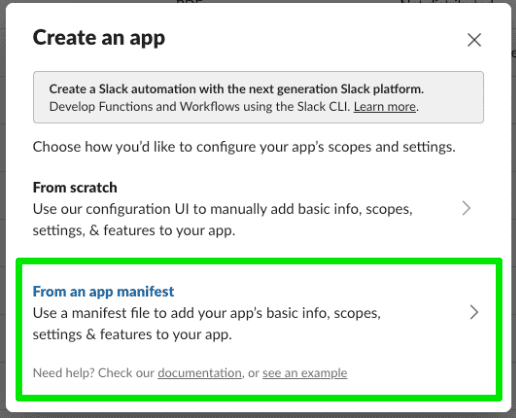

Next, select a workspace where you have permissions to install apps, and click **Next**. Select the **JSON** tab and clear the existing contents. Paste the contents of the `manifest.json` file you previously copied.

Click **Next** again. You will be shown a brief overview of the features your app includes. You'll see we are creating an app with a `chat:write` bot scope, an App Home and Bot User, as well as Socket Mode, Interactivity, an Event Subscription, and Org Deploy. We'll get into these details later. Click **Create**. 

### App settings {#app-settings}

All of your app's settings can be configured within these screens. By creating an app from an existing manifest, you will notice many settings have already been configured. Navigate to **Org Level Apps** and notice that we've already opted in. This is a requirement for adding workflow steps to an app. 

Navigate to **Event Subscriptions** and expand **Subscribe to bot events** to see that we have subscribed to the `function_executed` event. This is also a requirement for adding workflow steps to our app, as it lets our app know when a step has been triggered, allowing our app to respond to it. 

Another configuration setting to note is **Socket Mode**. We have turned this on for our local development, but socket mode is not intended for use in a production environment. When you are satisfied with your app and ready to deploy it to a production environment, you should switch to using public HTTP request URLs. Read more about getting started with HTTP in [Bolt for Python here](/tools/bolt-python/getting-started).

Clicking on **Workflow Steps** in the left nav will show you that one workflow step has been added! This reflects the `function` defined in our manifest: functions are workflow steps. We will get to this step's implementation later.

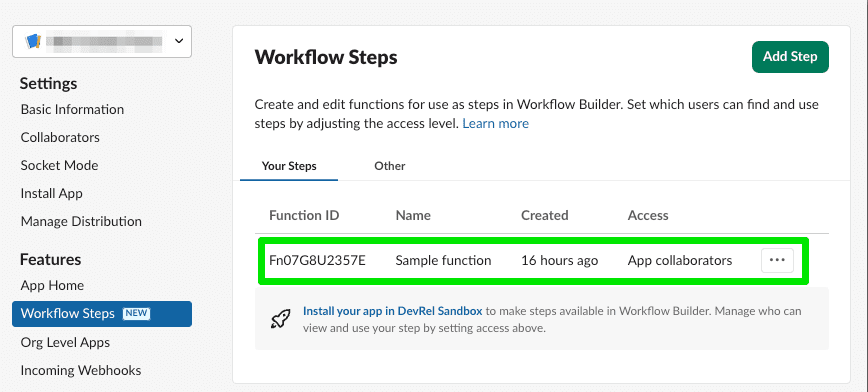

### Tokens {#tokens}

In order to connect our app here with the logic of our sample code set up locally, we need to obtain two tokens, a bot token and an app token. 

* **Bot tokens** are associated with bot users, and are only granted once in a workspace where someone installs the app. The bot token your app uses will be the same no matter which user performed the installation. Bot tokens are the token type that most apps use.
* **App-level** tokens represent your app across organizations, including installations by all individual users on all workspaces in a given organization and are commonly used for creating websocket connections to your app.

To generate an app token, navigate to **Basic Information** and scroll down to **App-Level Token**. 

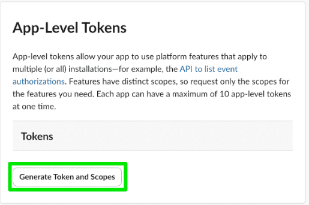

Click **Generate Token and Scopes**, then **Add Scope** and choose `connections:write`. Choose a name for your token and click **Generate**. Copy that value, save it somewhere accessible, and click **Done** to close out of the modal.

Next up is the bot token. We can only get this token by installing the app into the workspace. Navigate to **Install App** and click the button to install, choosing **Allow** at the next screen. 

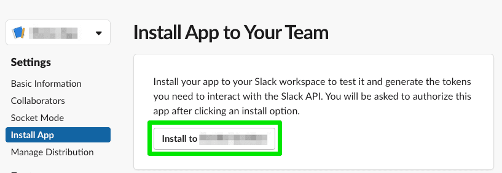

You will then have a bot token. Again, copy that value and save it somewhere accessible.

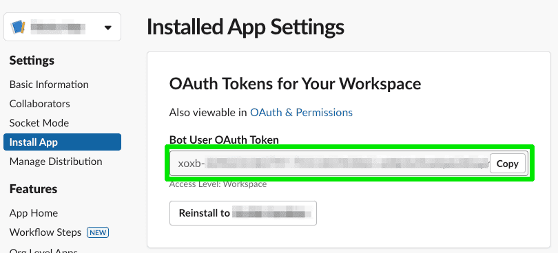

💡 Treat your tokens like passwords and keep them safe. Your app uses them to post and retrieve information from Slack workspaces. Minimally, do NOT commit them to version control.

## Starting your local development server {#local}

While building your app, you can see your changes appear in your workspace in real-time with `npm start`. Soon we'll start our local development server and see what our sample code is all about! But first, we need to store those tokens we gathered as environment variables. 

Navigate back to VSCode. Rename the `.env.sample` file to `.env`. Open this file and update `SLACK_APP_TOKEN` and `SLACK_BOT_TOKEN` with the values you previously saved. It will look like this, with your actual token values where you see `<your_app_token>` and `<your_bot_token>`:

```sh
SLACK_APP_TOKEN=<your_app_token>
SLACK_BOT_TOKEN=<your_bot_token>
```

Now save the file and try starting your app:

```sh
npm start
```

You'll know the local development server is up and running successfully when it emits a bunch of `[DEBUG]` statements to your terminal, the last one containing `connected:ready`.

With your development server running, continue to the next step.

:::info[If you need to stop running the local development server, press `<CTRL>` + `c` to end the process.]
:::

## Wiring up the sample step in Workflow Builder {#wfb}

The starter project you cloned contains a sample custom step lovingly titled “Sample step". Let’s see how a custom step defined in Bolt appears in Workflow Builder.

In the Slack Client of your development workspace, open Workflow Builder by clicking on the workspace name, **Tools**, then **Workflow Builder**. Create a new workflow, then select **Build Workflow**:

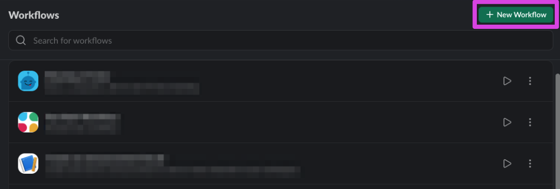

Select **Choose an event** under **Start the workflow...**, then **From a link in Slack** to configure this workflow to start when someone clicks its shortcut link:

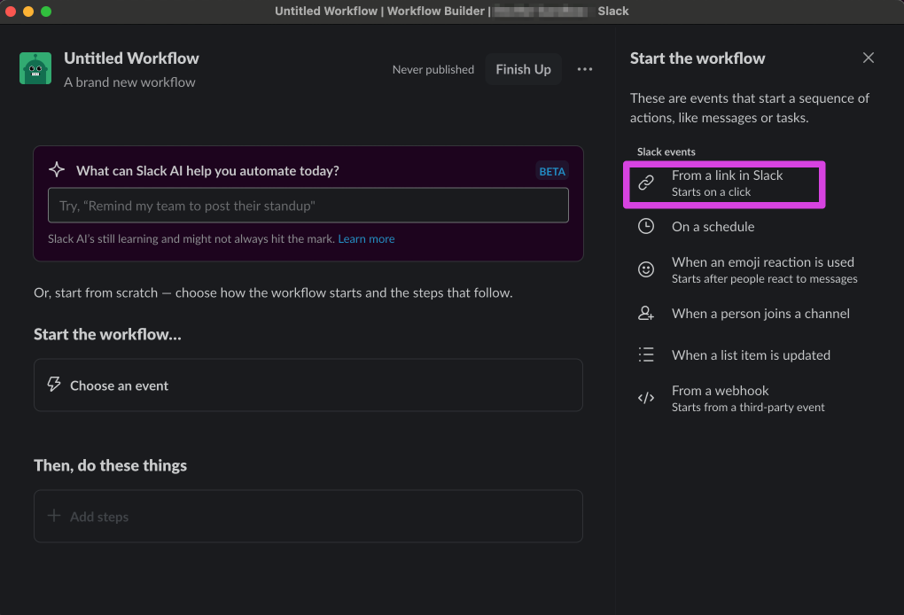

Click the **Continue** button to confirm that this is workflow should start with a shortcut link:

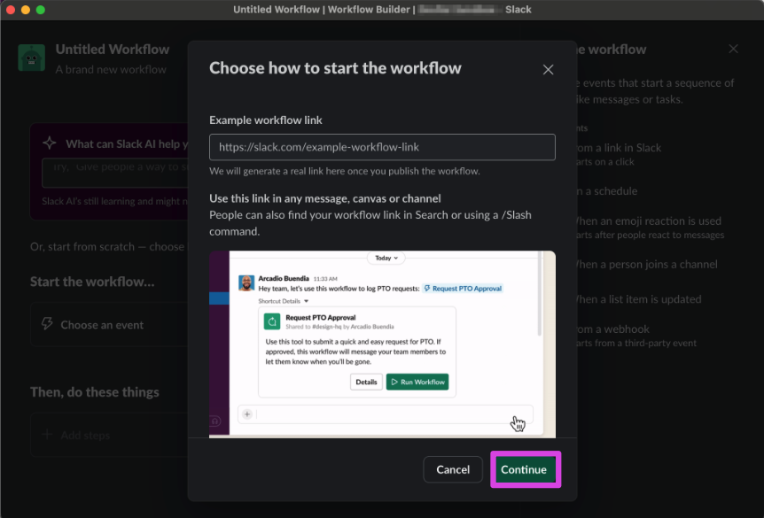

Find the sample step provided in the template by either searching for the name of your app (e.g., `Bolt Custom Step`) or the name of your step (e.g. `Sample step`) in the Steps search bar.

If you search by app name, any custom step that your app has defined will be listed.

Add the “Sample step" in the search results to the workflow:

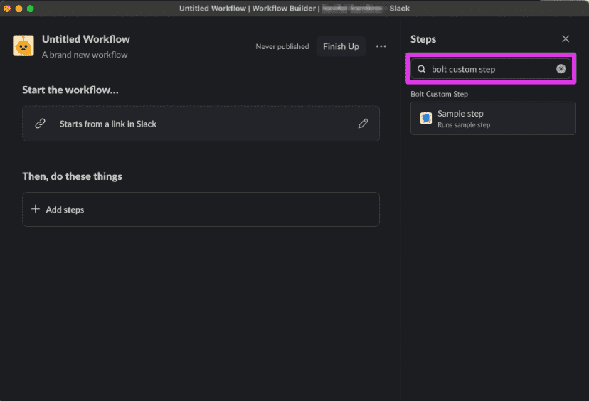

As soon as you add the “Sample step" to the workflow, a modal will appear to configure the step's input&mdash;in this case, a user variable:

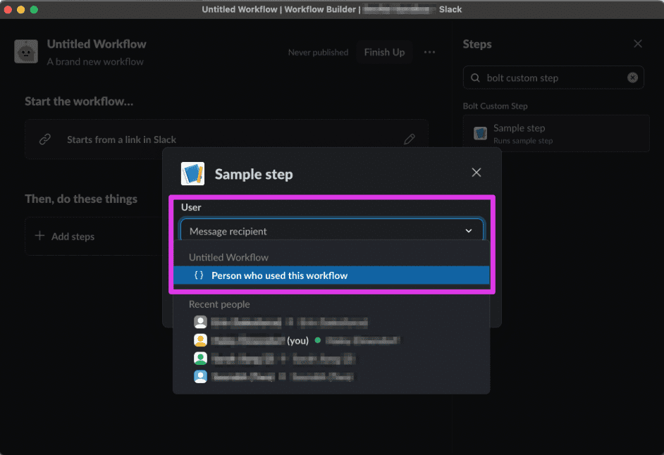

Configure the user input to be “Person who used this workflow”, then click the **Save** button:

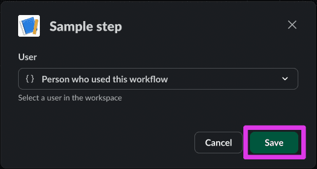

Click the **Finish Up** button, then provide a name and description for your workflow.

Finally, click the **Publish** button:

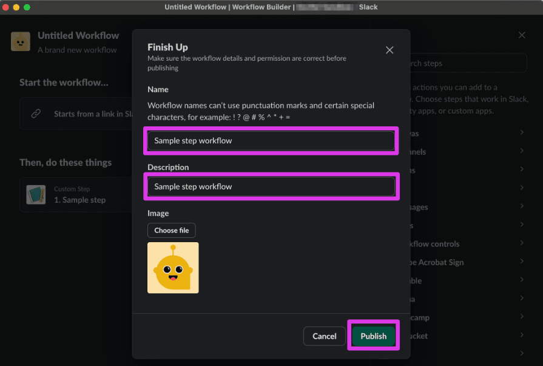

Copy the shortcut link, then exit Workflow Builder and paste the link to a message in any channel you’re in:

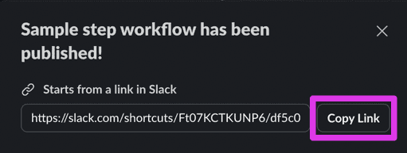

After you send a message containing the shortcut link, the link will unfurl and you’ll see a **Start Workflow** button.

Click the **Start Workflow** button:

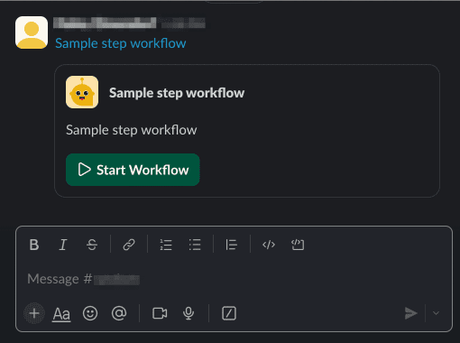

You should see a new direct message from your app:

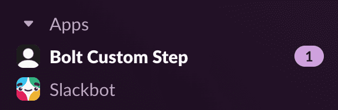

The message from your app asks you to click the **Complete step** button:

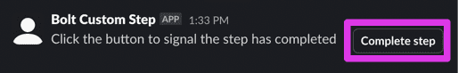

Once you click the button, the direct message to you will be updated to let you know that the step interaction was successfully completed:

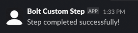

Now that we’ve gotten a feel for how we will use the custom step, let’s learn more about how function listeners work.

## Discovering listeners {#listeners}

Now that we’ve seen how custom steps are used in Workflow Builder, let’s understand how the function listener code works to respond to an event when the step is triggered.

We’ll first review the step definition in the `manifest.json`, then we’ll look at the two listener functions in our app code: one to let us know when the step starts, and one to let us know when someone clicks or taps one of the buttons we sent over.

### Defining the custom step {#define-custom-step}

Opening the `manifest.json` file included in the sample app shows a `functions` property that includes a definition for our `sample_step`:

```json
// manifest.json
...
    "functions": {
        "sample_step": {
            "title": "Sample step",
            "description": "Runs sample step",
            "input_parameters": {
                "user_id": {
                    "type": "slack#/types/user_id",
                    "title": "User",
                    "description": "Message recipient",
                    "is_required": true,
                    "hint": "Select a user in the workspace",
                    "name": "user_id"
                }
            },
            "output_parameters": {
                "user_id": {
                    "type": "slack#/types/user_id",
                    "title": "User",
                    "description": "User that completed the step",
                    "is_required": true,
                    "name": "user_id"
                }
            }
        }
    }
```

From the step definition, we can see an input parameter and an output parameter defined.

### Inputs and outputs {#inputs-outputs}

The custom step will take the following input: Message recipient (as a Slack User ID).

The custom step will produce the following output: The user that completed the step.

* When the step is invoked, a message will be sent to the user who invoked the workflow with a button to complete the step.
* When the button is clicked, a message is posted indicating the step's completion.

### Implementing the function listener {#function-listener}

The first thing we’ll do when adding a custom workflow step to our Bolt app is register a new **function listener**. In Bolt, a function listener allows developers to execute custom code in response to specific Slack events or actions by registering a method that handles predefined requests or commands. We register a function listener via the `function` method provided by our app instance.

1. Open your project’s `app.py` file in your code editor.
2. Between the initialization code for the app instance and the `sample_step` registration, you'll see a listener defined for our custom step:

```py
# app.py
...
@app.function("sample_step")
def handle_sample_step_event(inputs: dict, say: Say, fail: Fail, logger: logging.Logger):
    user_id = inputs["user_id"]

    try:
        say(
            channel=user_id,  # sending a DM to this user
            text="Click the button to signal the step has completed",
            blocks=[
                {
                    "type": "section",
                    "text": {"type": "mrkdwn", "text": "Click the button to signal the step has completed"},
                    "accessory": {
                        "type": "button",
                        "text": {"type": "plain_text", "text": "Complete step"},
                        "action_id": "sample_click",
                    },
                }
            ],
        )
    except Exception as e:
        logger.exception(e)
        fail(f"Failed to handle a step request (error: {e})")


```

#### Anatomy of a `.function()` listener {#function-listener-anatomy}

The function decorator (`function()`) accepts an argument of type `str` and is the unique callback ID of the step. For our custom step, we’re using `sample_step`. Every custom step you implement in an app needs to have a unique callback ID.

The callback function is where we define the logic that will run when Slack tells the app that a user in the Slack client started a workflow that contains the `sample_step` custom step.

The callback function offers various utilities that can be used to take action when a step execution event is received. The ones we’ll be using here are:

* `inputs` provides access to the workflow variables passed into the step when the workflow was started
* `fail` indicates when the step invoked for the current workflow step has an error
* `logger` provides a Python standard logger instance
* `say` calls the `chat.Postmessage` API method

#### Understanding the function listener's callback logic {#function-listener-callback-logic}

When our step is executed, we want a message to be sent to the invoking user. That message should include a button that prompts the user to complete the step. 

When Slack tells your Bolt app that the `sample_step` step was invoked, this step uses `chat.postMessage` to send a message to the `user_id` channel (which means this will be sent as a DM to the Slack user whose ID == `user_id`) with some text and blocks. The Block Kit element being sent as part of the message is a button, labeled 'Complete step' (which sends the `sample_click` action ID).

Once the message is sent, your Bolt app will wait until the user has clicked the button. As soon as they click or tap the button, Slack will send back the action ID associated with the button to your Bolt app.

In order for your Bolt app to listen for these actions, we’ll now define an action listener.

### Implementing the action listener {#action-listener}

The message we send to the user will include the button prompting them to complete the step. 

To listen for and respond to this button click, you'll see an `.action()` listener to `app.py`, right after the function listener definition:

```py
# app.py
...
@app.action("sample_click")
def handle_sample_click(
    ack: Ack, body: dict, context: BoltContext, client: WebClient, complete: Complete, fail: Fail, logger: logging.Logger
):
    ack()

    try:
        # Since the button no longer works, we should remove it
        client.chat_update(
            channel=context.channel_id,
            ts=body["message"]["ts"],
            text="Congrats! You clicked the button",
        )

        # Signal that the step completed successfully
        complete({"user_id": context.actor_user_id})
    except Exception as e:
        logger.exception(e)
        fail(f"Failed to handle a step request (error: {e})")

```

#### Anatomy of an `.action()` listener {#action-listener-anatomy}

Similar to a function listener, the action listener registration method (`.action()`) takes two arguments:

* The first argument is the unique callback ID of the action that your app will respond to. 
* The second argument is an asynchronous callback function, where we define the logic that will run when Slack tells our app that the user has clicked or tapped the button.

Just like the function listener’s callback function, the action listener’s callback function offers various utilities that can be used to take action when an action event is received. The ones we’ll be using here are:

* `client`, which provides access to Slack API methods
* `action`, which provides the action’s event payload
* `complete`, which is a utility method indicating to Slack that the step behind the workflow step that was just invoked has completed successfully
* `fail`, which is a utility method for indicating that the step invoked for the current workflow step had an error

#### Understanding the action listener's callback logic {#action-listener-callback-logic}

Recall that we sent over a message with the button back in the function listener.

When the button is pressed, we want to complete the step, update the message, and define `outputs` that can be used for subsequent steps in Workflow Builder.

Slack will send an action event payload to your app when the button is clicked or tapped. In the action listener, we extract all the information we can use, and if all goes well, let Slack know the step was successful by invoking `complete`. We also handle cases where something goes wrong and produces an error.

## Next steps {#next-steps}

That's it — we hope you learned a lot!

In this tutorial, we added custom steps via the manifest, but if you'd like to see how to add custom steps in the [app settings](https://api.slack.com/apps) to an existing app, follow along with the [Create a custom step for Workflow Builder: existing Bolt app](/tools/bolt-python/tutorial/custom-steps-workflow-builder-existing) tutorial.

If you're interested in exploring how to create custom steps to use in Workflow Builder as steps with our Deno Slack SDK, too, that tutorial can be found [here](/deno-slack-sdk/tutorials/workflow-builder-custom-step/).
